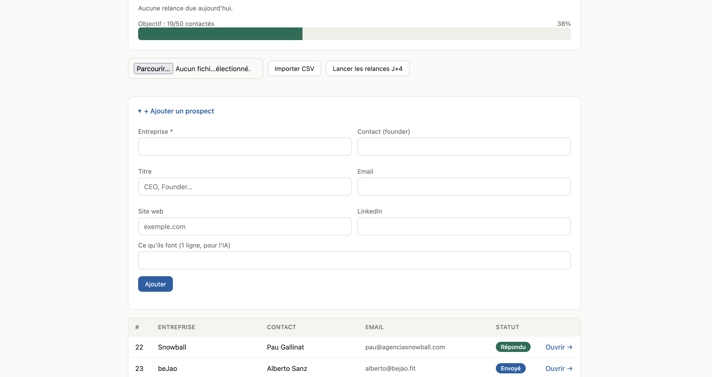

# Founder Outreach Agent

A small, practical CLI that semi-automates cold outreach to startup founders — built to run my own internship search, and kept deliberately ethical and human-in-the-loop.

It imports a list of target companies, uses an LLM to draft a **personalized** email per founder (based on what their company actually does), lets me review before anything is sent, sends via my own Gmail, and schedules follow-ups — automatically skipping anyone who already replied.

> Built by Lilian Miceli while searching for a 6-month Founder's Associate / Growth internship in Barcelona. The project is itself a demonstration of the role: take a fuzzy, manual process and turn it into a working system.

## Why semi-automated (and not a spam bot)

Cold outreach only works when it's specific and human. So the design follows two rules:

- **Email is automated, LinkedIn is not.** Auto-DMing on LinkedIn violates their ToS and gets accounts banned — and founders spot bots instantly. LinkedIn stays manual.
- **The agent drafts, the human approves.** Nothing is sent without review. There's a `--dry-run` mode (default for testing) and a daily send cap to protect deliverability.

## What it does

1. **Import** target founders from an Apollo CSV export.
2. **Draft** a tailored email per founder: the LLM reads a one-line company description (and optionally scrapes the homepage) and writes a sharp, specific message.
3. **Review & send** from your own Gmail (SMTP).
4. **Follow up** at J+4 and J+10 — but checks your inbox (IMAP) first and skips anyone who replied.

## Architecture

```
cli.py        # command-line entry point (init / import / list / draft / send / followup)
config.py     # all settings, loaded from .env
db.py         # SQLite storage + Apollo CSV import
enrich.py     # light homepage scraping to feed the LLM
generate.py   # LLM call -> personalized {subject, body}
emailer.py    # SMTP send + IMAP reply detection
data/         # your CSV exports (gitignored, except the example)
```

## Setup

```bash
git clone <your-repo>
cd outreach-agent
python -m venv .venv && source .venv/bin/activate
pip install -r requirements.txt
cp .env.example .env   # then fill in your keys
python cli.py init
```

Two keys to fill in `.env`:

- **LLM** — get a **free Groq key** at [console.groq.com](https://console.groq.com) (no credit card). The agent defaults to Groq; set `LLM_PROVIDER=anthropic` if you'd rather use Claude.
- **Email** — for Gmail, create an **App Password** (Google Account → Security → 2-Step Verification → App passwords) and put it in `.env` as `EMAIL_APP_PASSWORD`. Never your normal password.

## Usage

```bash
# 1. Import an Apollo export
python cli.py import data/targets.csv

# 2. See your pipeline
python cli.py list

# 3. Draft a personalized email for prospect #1
python cli.py draft --id 1

# 4. Preview without sending, then send for real
python cli.py send --id 1 --dry-run
python cli.py send --id 1

# 5. Run follow-ups (skips anyone who replied)
python cli.py followup --stage 1 --dry-run
python cli.py followup --stage 1
```

## Web dashboard

Prefer clicking to typing? A local web UI ships with the project:

```bash
python app.py        # then open http://localhost:5000
```

From the dashboard you can add a prospect, import a CSV, generate and edit drafts, preview or send emails, change statuses, keep notes, and trigger follow-ups — all without the terminal. A `/stats` page shows your funnel and reply rate so you can measure your outreach like a growth team. It runs entirely on your machine; your keys never leave it.

`python seed.example.py` loads anonymised sample prospects. Copy it to `seed.py` (gitignored) to keep your own real data private.



## Tests

```bash
pytest
```

The database layer is covered by unit tests that run against a temporary DB, so they never touch your real data.

## Roadmap

- [x] Local web dashboard + stats funnel
- [ ] Daily send-cap enforcement
- [ ] Per-founder hook variants for A/B testing
- [ ] Scheduled follow-ups (cron)
- [ ] Optional: pull funding/news signals as hooks

## Stack

Python · SQLite · Groq / Anthropic LLM · SMTP/IMAP · BeautifulSoup. No heavy framework — readable on purpose.
